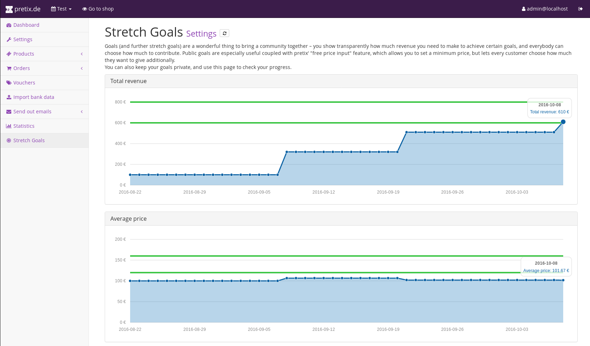
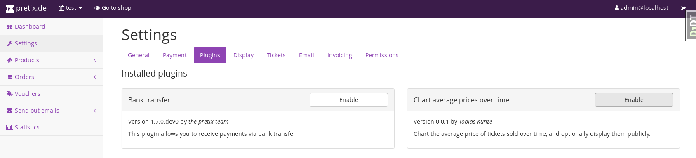

pretix-stretchgoals
===================

This is a plugin for `pretix`_ that allows you to define public or private goals that you want to reach in your presale.

Installation
------------

`pretix-stretchgoals` has not been released on PyPI yet, so you have to install it from this repository::

   pip install git+https://github.com/rixx/pretix-stretchgoals.git

Then go to your event's plugin settings, and activate `pretix-stretchgoals`:

You will now find a new entry in your side bar, and can proceed to configure the settings, add goals, and either look
at them in the backend, or present them publicly in your frontend.

Development setup
-----------------

1. Make sure that you have a working `pretix development setup`_.

2. Clone this repository, eg to ``local/pretix-stretchgoals``.

3. Activate the virtual environment you use for pretix development.

4. Execute ``pip install -e .`` within this directory to register this application with pretix's plugin registry.

5. Execute ``make`` within this directory to compile translations.

6. Restart your local pretix server. You can now use the plugin from this repository for your events by enabling it in
   the 'plugins' tab in the settings.

License
-------

Copyright 2017 Tobias Kunze

Released under the terms of the Apache License 2.0

.. _pretix: https://github.com/pretix/pretix
.. _pretix development setup: https://docs.pretix.eu/en/latest/development/setup.html
